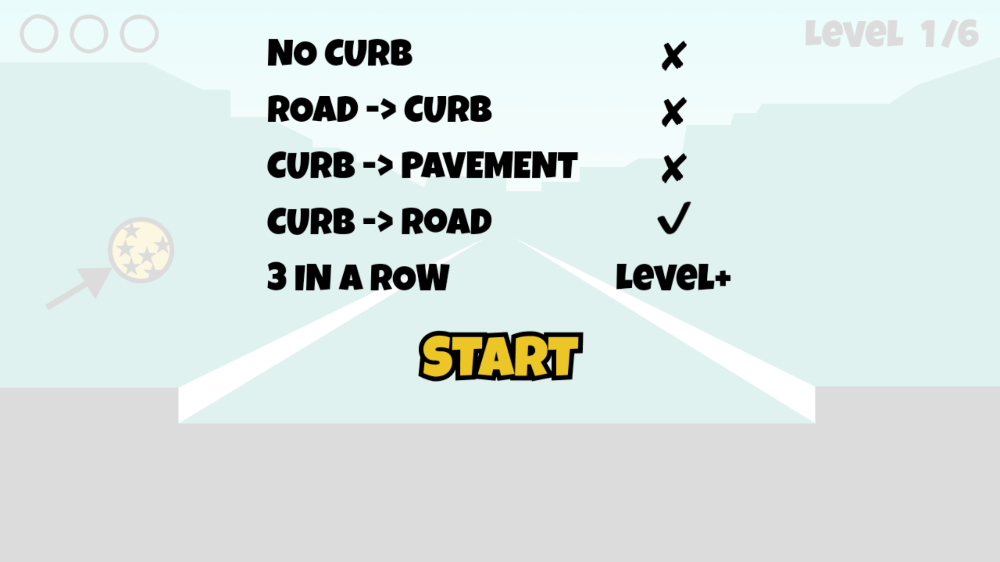
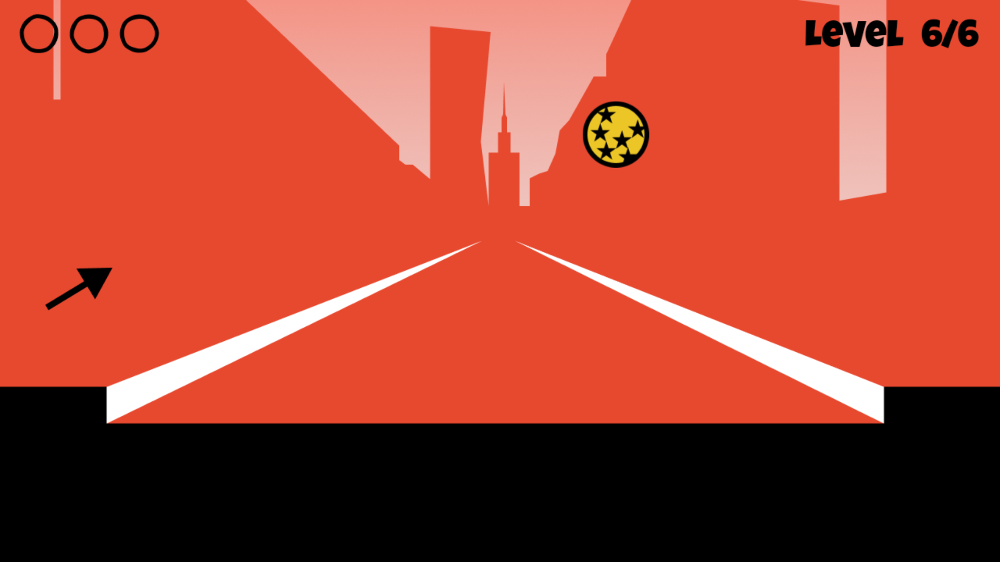

# Curbs (Krawężniki)

A mobile game based on "krawężniki" — a real street game played by bouncing a ball off a curb. Hit the curb across the street, catch the rebound, and do it 3 times in a row to advance. 6 levels, randomized order, free, no ads.

> Co-developed with [Ravenyy](https://github.com/Ravenyy). Built in GDevelop and published to Google Play in February 2022 (the listing is no longer live). A full rewrite in Godot followed as a separate learning project — see [curbs-godot](https://github.com/nieczuje/curbs-godot).

## Demo

| Rules | Gameplay (Level 6/6) |
|---|---|
|  |  |

*(gameplay video to be added)*

## Development history

This repo's git history is reconstructed from the real timestamps of the original project files (saved locally rather than version-controlled at the time) — every commit date reflects when that save actually happened, from the earliest prototype (Feb 3, 2022) through the final build submitted to Google Play (Feb 18, 2022). The `builds/` folder keeps every APK/AAB iteration along the way. `experiments/randomized_levels/` is a side experiment with a shuffled level order.

## Credits

- Title font: [Luckiest Guy](https://fonts.google.com/specimen/Luckiest+Guy), Apache License 2.0.
